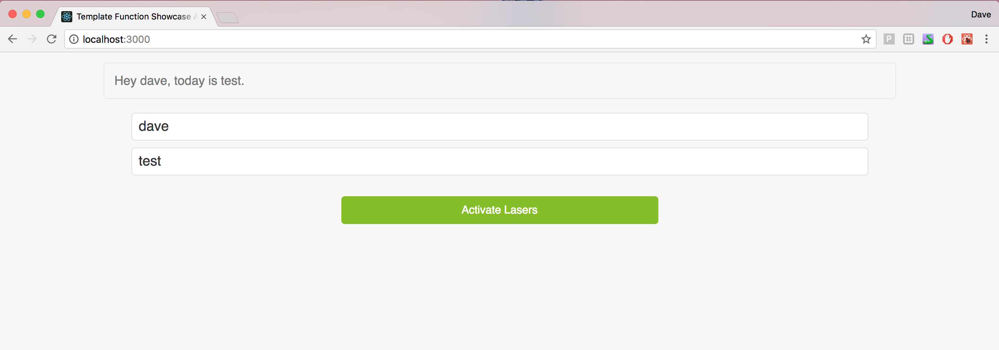

This project was bootstrapped with [Create React App](https://github.com/facebookincubator/create-react-app).


Run with npm build -> npm start


Code snippet for the function:
```javascript
function template(str, context) {
const pattern = /{(.\*?)}+/g;
return str.replace(pattern, function($1, $2) {
return context[$2];
});
}
```

Usage in the App:

let str = 'Hey {name}, today is {day}.';

---

| State gets populated from text field and then passed into context |

this.state = {
name: '',
day: '',
};

template(str, this.state)


